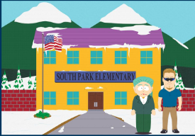

```{r setup, include=FALSE}
knitr::opts_chunk$set(echo = TRUE)
```

## South Park Elementary School Data



Mayor McDaniels and Peter Charles (aka PC Principal) are concerned that even after removing direct identifiers such as names, SSNs, and IDs, students may still be easily re-identified in the yearly assessment dataset and have their math and reading scores revealed. For example, everyone in school knows that Tolkien Williams is the wealthiest kid in the whole town, whereas Kenny and his sister Karen are from a very poor family.

They have requested our assistance to compute the risk of disclosure, implement strategies to minimize it, and determine the information loss for the anonymized dataset they would like to make public to other school board members\*. They have asked for our help, and we will be using the sdcMicro package for this purpose.

In summary, our client has three main questions for us (and none of them involve finding out who keeps killing Kenny and how he keeps coming back to life):

Q1. What is the level of disclosure risk associated with this dataset?

Q2. How can the risk of re-identification be significantly reduced?

Q3. What would be the utility and information loss after implementing the anonymization strategies?

\*Caveat: We have a relatively small dataset for this exercise (rows and columns), so we can't strive for some of the thresholds recommended in the literature.

#### Package & Data

```{r}
# Required Package
library(sdcMicro)

# Dataset
data <- read.csv("southpark-sdc.csv")
```

#### Taking a closer look at the variables included in this dataset

```{r}
# Read the CSV dataset into a data frame
df <- read.csv("southpark-sdc.csv")

# Show the list of variable names
options(scipen = 999) #remove scientific notation, if any
head(df)
str(df)
```

#### Data Prep - Converting variables

As we can see, we will need to convert some of the variables first.

The stu-id, SSN, name and dob will be removed soon from the dataset as they are direct identifiers.

Let's focus on the remaining ones that should be converted before we can proceed.

```{r}
fname = "southpark-sdc.csv"
file <- read.csv(fname)
file <- varToFactor(obj=file, var=c("zip","age", "sex","race","ethn", "snap", "income", "learn_dis","phys_dis"))
file <- varToNumeric(obj = file, var=c("stu_id", "math_sc","read_sc"))
```

#### Q1. What is the level of disclosure risk associated with this dataset?

To answer this question we have to set up an SDC problem. In other words we must select variables and create an object of class *sdcMicroObj* for the SDC process in *R.*

```{r}
# Select variables for creating sdcMicro object
# All variable names should correspond to the names in the data file
# select categorical key variables - aka quasi-identifiers

sdcInitial <- createSdcObj(dat=file,
                       keyVars=c("zip","age", "sex","race","ethn", "snap", "income", "learn_dis","phys_dis"),
                       numVars=c("stu_id","math_sc","read_sc"),
                       weightVar=NULL,
                       hhId=NULL,
                       strataVar=NULL,
                       pramVars=NULL,
                       excludeVars=c("ssn","name","dob"),
                       seed=0,
                       randomizeRecords=FALSE,
                       alpha=c(1))
# Summary of object
sdcInitial
```

We are keeping the student id for now, as we will later create a hash/token to replace it in the anonymized dataset.

Check the results below, and the number of observations that violate 2-5 anonymity. What does that mean?

##### Time to calculate the risk of re-identification for the entire dataset

```{r}
# The treshold depends on the size of the dataset and the access control (conservative number for large surveys are 0.04)
sdcInitial@risk$global$risk
```

Over 81%? That is terrible! Let's see if we can get that lowered to less than 15% and a k=5.

We have to get some work done to reduce that. But that would be the first answer to our clients.

We can inspect this issue a little further before moving to the second question.

##### Which observations/subjects have a higher risk to be re-identified?

```{r}
sdcInitial@risk$individual
```

##### How many combinations of key variables each record have?

```{r}
#Categorical variable risk
#Frequency of the particular combination of key variables (quasi-identifiers) for each record in the sample
freq(sdcInitial, type = 'fk')
```

#### Q2. How can the risk of re-identification be significantly reduced?

We learned that there are different techniques to de-identify and anonymize datasets.

First, let's use some non-perturbative methods such as global recoding and top and bottom coding techniques.

*Income*

As mentioned before, the household income of some students may pose a risk to their privacy in this dataset. So let's see if using top and bottom recoding could help reducing that risk.

```{r}
# Frequencies of income before recoding
table(sdcInitial@manipKeyVars$income)
```

```{r}
## Recode variable income (top coding)
sdcInitial <- groupAndRename(obj= sdcInitial, var= c("income"), before=c("200,000-249,999","500,000+"), after=c("200,000+"))

## Recode variable income (bottom coding)
sdcInitial <- groupAndRename(obj= sdcInitial, var= c("income"), before=c("10,000-24,999","75,000-99,999"), after=c("10,000-99,999"))
```

*Age*

```{r}
# Frequencies of age before recoding
table(sdcInitial@manipKeyVars$age)
```

```{r}
#Recode Age 

sdcInitial <- groupAndRename(obj= sdcInitial, var= c("age"), before=c("8","9","10"), after=c("8-10"))                                                 
sdcInitial <- groupAndRename(obj= sdcInitial, var= c("age"), before=c("11","12","13"), after=c("11-13"))
```

##### **Note: Undoing things**

```{r}
# Important note: If the results are reassigned to the same sdcMicro object, it is possible to undo the last step in the SDC process. Using:
# sdcInitial <- undolast(sdcInitial)
# It might be helpful to tune some parameters. The results of the last step, however, will be lost after undoing that step. 
# We can also choose to assign results to a new sdcMicro object this time, using:
# sdc1 <- functionName(sdcInitial) specially if you anticipate creating multiple sdc problems to test out.Otherwise, you can delete the object and re-run the code when needed
```

Let's see if those steps lowered the risk of re-identification of subjects.

```{r}
sdcInitial@risk$global$risk
print(sdcInitial, 'kAnon')
```

Only a tiny improvement compared to the original dataset. Let's try something else.

##### Time for a more powerful technique. Let's use the k-anonymization function!

```{r}
#Local suppression to obtain k-anonymity
sdcInitial <- kAnon(sdcInitial, k=c(5))

# Setting the parameters that we are aiming for at least 5 observations sharing the same attributes in the dataset.

#Alternatively, we could have set the order of importance for each keyvariables
#sdcInitial <- kAnon(sdcInitial, importance=c(9,5,6,7,8,4,3,1,2), k=c(5))
```

More on importance (pg. 50): <https://cran.r-project.org/web/packages/sdcMicro/sdcMicro.pdf>

Time to check it again:

```{r}
sdcInitial@risk$global$risk
print(sdcInitial, 'kAnon')
```

Alright! We managed lower the risk of identification from 81% to about 10% and now we have 0 observations violating 5-anonymity! We can tell our clients we used some recoding, but supression via k-anonymity was necessary to improve the privacy level of this dataset.

#### Q3. What would be the utility and information loss after implementing anonymization strategies?

##### Time to measure the utility and information loss for the anonymized dataset.

```{r}
#First we retrieve the total number of supressions for each categorical key variable
print(sdcInitial, 'ls')
```

```{r}
#We can also compare the number of NAs before and after our interventions
# Store the names of all categorical key variables in a vector
namesKeyVars <- names(sdcInitial@manipKeyVars)

# Matrix to store the number of missing values (NA) before and after anonymization
NAcount <- matrix(NA, nrow = 2, ncol = length(namesKeyVars))
colnames(NAcount) <- c(paste0('NA', namesKeyVars)) # column names
rownames(NAcount) <- c('initial', 'treated') # row names

# NA count in all key variables (NOTE: only those coded NA are counted)
for(i in 1:length(namesKeyVars)) {
  NAcount[1, i] <- sum(is.na(sdcInitial@origData[,namesKeyVars[i]]))
  NAcount[2, i] <- sum(is.na(sdcInitial@manipKeyVars[,i]))}

# Show results
NAcount
```

Based on the results we can tell PC Principal and the Mayor that the suppression greatly reduced the level of detail about the income and the race of the students. We could continue exploring removing other less relevant variables and explore other functions in this package or even considering different ways of recoding that variable. But let's call the day for today, and export the anonymized dataset we produced.

##### Creating a new random number to replace the student ID

```{r}
## Adding a new randomized ID-variable
sdcInitial <- createNewID(sdcInitial, newID="ID", withinVar="stu_id")
```

##### Exporting the anonymized dataset

```{r}
writeSafeFile(obj=sdcInitial, format="csv", randomizeRecords="no", col.names=TRUE, sep=",", dec=".", fileOut="southpark-anon.csv")
```
